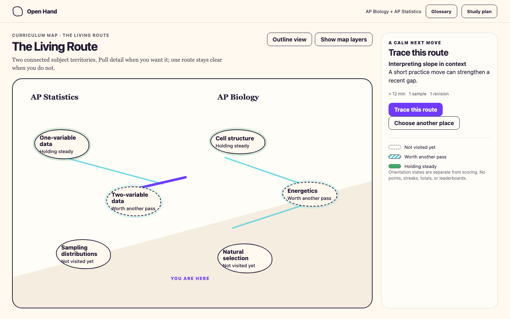
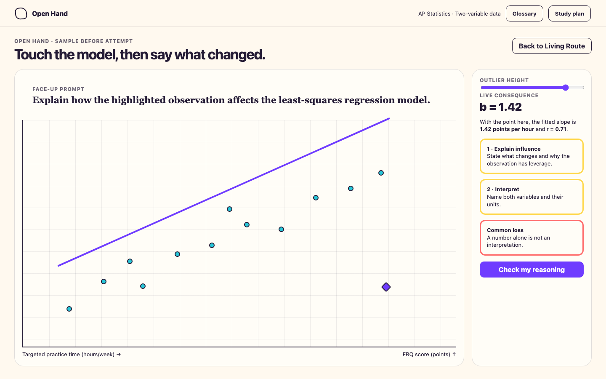
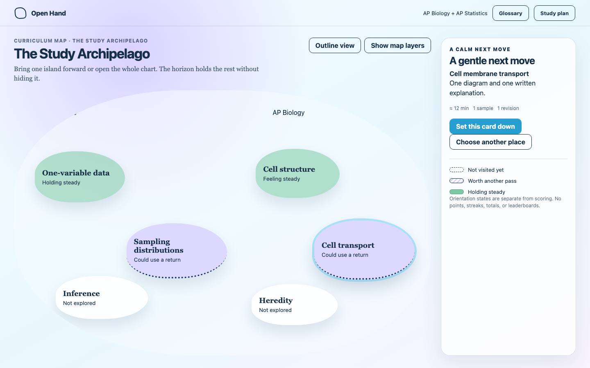
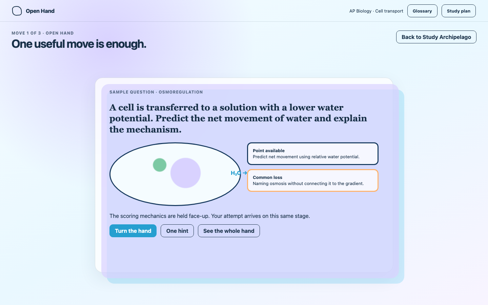
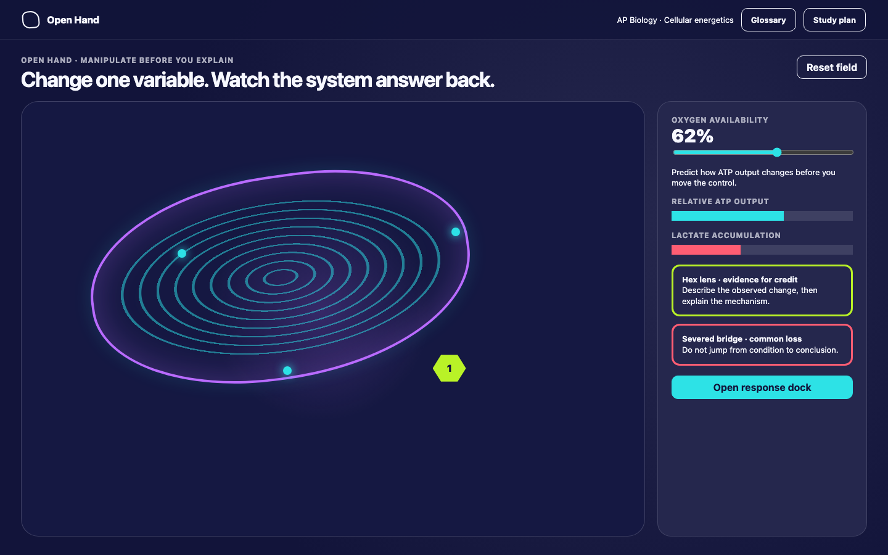
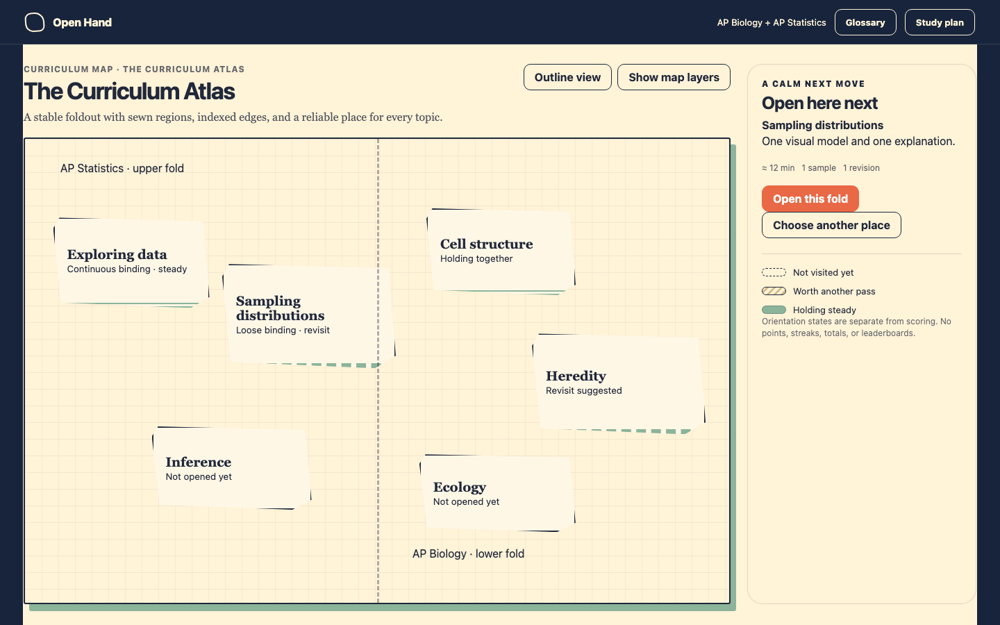
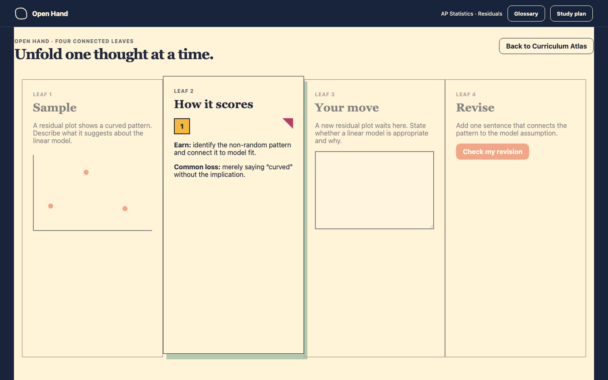
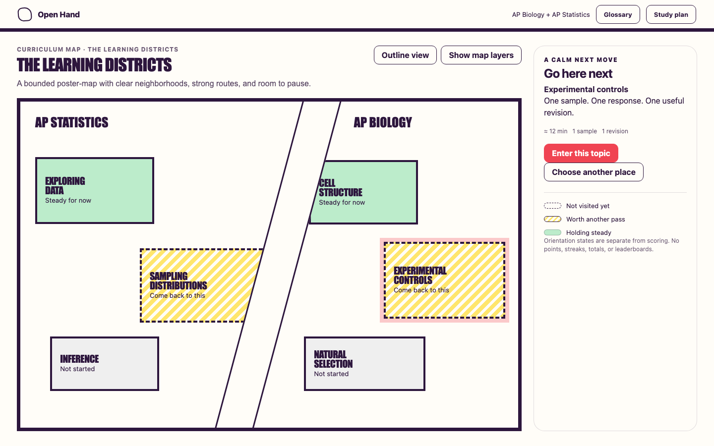
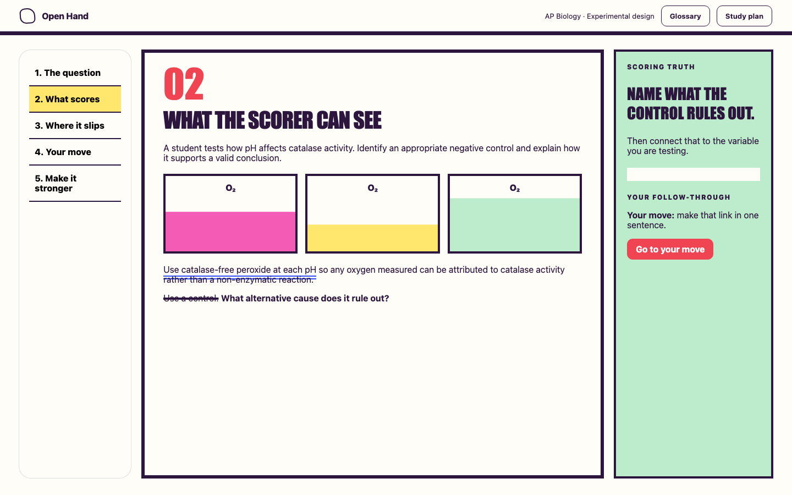
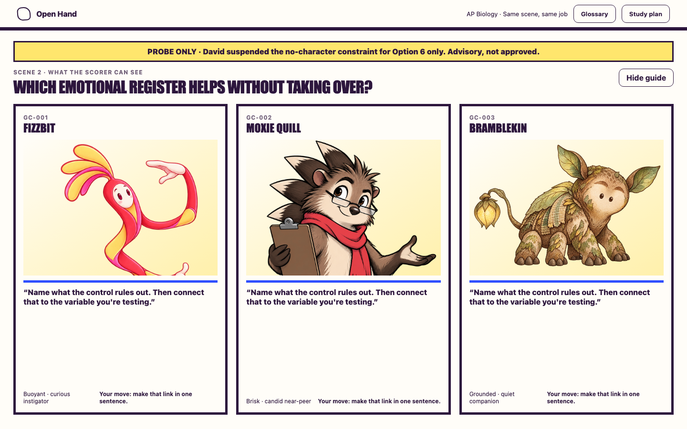

# Project Crux — six-direction visual review board

> Advisory review set. These renderings are not final or approved, and they do not indicate a selection. David alone decides when Visual Design or UX is done.

The images below are the canonical 1440 × 900 review plates. Each nearby HTML file is the inspectable source and includes the direction's small interaction beat.

## 01 — Draw the Door: Influence Lab

Place / overview — The Living Route:

Working mode — draggable/scrubbable influence consequence:

## 02 — Soft Landing

Place / overview — The Study Archipelago:

Working mode — centered single-card stage:

## 03 — Pocket Universe

Working mode — manipulable cellular-energetics field. Place mode remains deferred by Handoff 006.

## 04 — Lantern Fold

Place / overview — The Curriculum Atlas:

Working mode — connected four-leaf folio:

## 05 — Say It Bright, text-only

Place / overview — The Learning Districts:

Working mode — five-scene graphic sequence:

## 06 — Say It Bright: Three Guide Registers

The no-character constraint is suspended for this probe only by David's explicit instruction. These are three alternatives for one guide slot, not a cast.

The stable guide concepts, provenance, guardrails, and future exploration slots live in `../guide-concepts/`.
